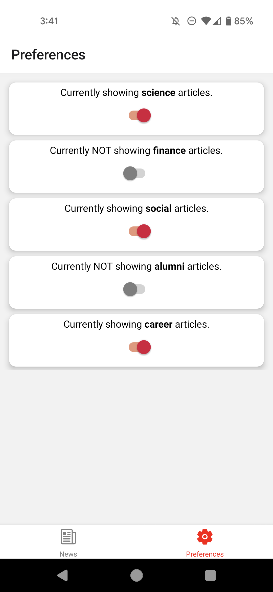

# Badger News

Welcome to Badger News! Badger News, developed with HTML, CSS, JavaScript, React Native, Node.js, Expo, and Figma, optimizes content delivery by dynamically updating articles and user preferences based on interaction data. The application incorporates the Animated API to ensure smooth transitions and visual enhancements, improving the overall readability and user experience. Designed for versatility, it adapts flawlessly to various devices and screen orientations, leveraging React Native's robust styling features to maintain a consistent and engaging user interface across platforms.

The code was generated using [expo](https://expo.dev/) and all the necessary libraries for [react navigation](https://reactnavigation.org/). See the `package.json` for details. 

### API Notes

All data can be retrieved via API calls to `https://cs571.org/api/s24/hw8/`. A brief overview of the API is provided below. There is no further documentation as this API only supports `GET` requests. Please use Postman to explore the API in greater depth.

`https://cs571.org/api/s24/hw8/articles` returns a short summary of each of the news articles including an `id`, `img`, `title`, `tags`, and `fullArticleId`. You may assume the `id` is unique for each article. The `fullArticleId` is also unique and can be used to fetch additional details below.

`https://cs571.org/api/s24/hw8/article?id=ARTICLE_ID` returns the details for a particular article id (from the `fullArticleId` above). **This endpoint is intentionally slow.** These details include all of the properties of the short summary as well as additional `body`, `author`, `posted`, and `url` properties. In particular...

 - `body` is a `list` of `string` where each item is a paragraph
 - `author` is a `string` of the author of the article
 - `posted` is a `string` representing the date the article was posted
 - `url` is `string` linking to the real article on [news.wisc.edu](https://news.wisc.edu/)

 The `img` may be appended to `https://raw.githubusercontent.com/CS571-S24/hw8-api-static-content/main/` to get the requested image, e.g. the image `teach.png` is hosted at `https://raw.githubusercontent.com/CS571-S24/hw8-api-static-content/main/teach.png`

 Please note that, while the news articles on [news.wisc.edu](https://news.wisc.edu/) have pictures embedded within the article, the API does not have these.

### 4. Apply Preferences

You should be able to apply your own news preferences via the "Preferences" tab. This tab should display [switches](https://reactnative.dev/docs/switch) (**on:** opt in, **off:** opt out) for each of the unique tags. 

